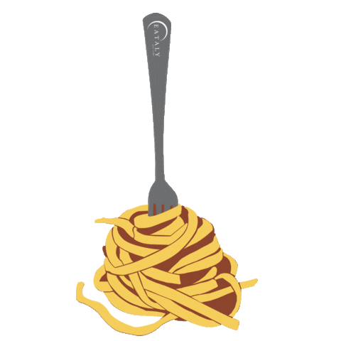
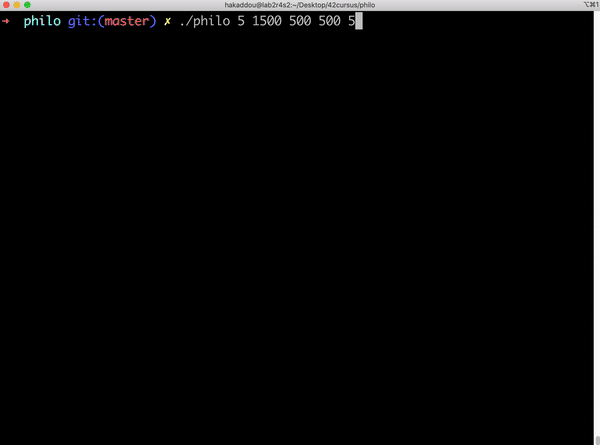

<div align="center">
  <a href="https://github.com/hadi14250">
    
  </a>

  <h1 align="center">Philosophers</h1>

  <p align="center">
    A multithreaded simulation of the classic Dining Philosophers problem
  </p>

  <br>

  <a href="https://github.com/hadi14250">
    
  </a>
</div>

<br>

## About the Project

This project explores one of the most well-known concurrency challenges in computer science: the **Dining Philosophers problem**.

Several philosophers sit around a shared table, alternating between thinking, eating, and sleeping. Each meal requires two forks that must be shared with their neighbors. The simulation uses **threads** and **mutexes** to coordinate every philosopher so that no one starves and no deadlock ever occurs.

<br>

## Features

- 🔄 **Multithreaded execution** — one thread per philosopher
- 🚦 **Deadlock-free** fork acquisition strategy
- 🧩 **Mutex-based synchronization** for shared state and output
- ⏱️ **Precise timing** to detect starvation the moment it happens

<br>

## Getting Started

### Build

From the project root, compile the program with:

```sh
make
```

### Run

Launch a simulation with:

```sh
./philo <number_of_philosophers> <time_to_die> <time_to_eat> <time_to_sleep> [number_of_times_each_philosopher_must_eat]
```

### Example

```sh
./philo 5 1000 400 400 5
```

<br>

## Arguments

| Argument | Unit | Description |
| --- | --- | --- |
| `number_of_philosophers` | count | How many philosophers sit at the table. The same number of forks are placed between them. |
| `time_to_die` | ms | The maximum delay a philosopher can go without starting a new meal before they die. The countdown starts at the beginning of the simulation or at the start of their previous meal. |
| `time_to_eat` | ms | How long a philosopher takes to finish a meal while holding both forks. |
| `time_to_sleep` | ms | How long a philosopher rests after eating before they begin thinking again. |
| `number_of_times_each_philosopher_must_eat` | count *(optional)* | When every philosopher has eaten at least this many times, the simulation ends successfully. If omitted, the simulation only ends when a philosopher dies. |

<br>

## Rules

- Philosophers are numbered from `1` to `number_of_philosophers`.
- Seating is **circular**: philosopher `1` sits next to philosopher `number_of_philosophers`, and any philosopher `N` sits between `N - 1` and `N + 1`.
- Each philosopher needs **two forks** to eat — one shared with each neighbor.
- If a philosopher does not start a new meal within `time_to_die` milliseconds, they die and the simulation ends.

<br>

<div align="center">
  <sub>Built as part of the 42 curriculum</sub>
</div>
